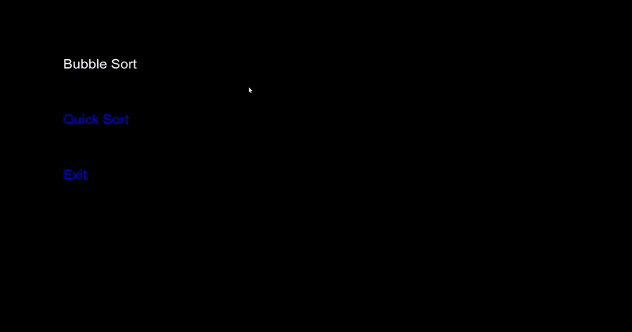

# Visualising Sorting Algorithms in C++ SFML

## Motivation
This project was inspired by my interest in gaming and coding in C++. Throughout this project, my purpose was to learn the fundamentals of
SFML, which is primarily a game development library in C++. I got the idea of visualising sorting algorithms from Harvard’s CS50 course, where
I implemented various sorting algorithms in C. I knew the complexity and methodology of these algorithms, but thought that being able to visualise them
would be cool too.

## Installation
***If*** you would like to contribute (adding new algorithms should be really trivial, just make sure to call the draw function each time you
cary out a swap, the menu is a little bit messy but it's basically all in a switch statement) you will need to download SFML. 

I recommend following ***[this tutorial](https://youtu.be/YfMQyOw1zik)*** to get it running on a simple boilerplate project for the first time, and then linking the dependencies with this project once you've 
cloned my repo to your computer. 
If you want to statically link your dependencies, ***[follow this other tutorial](https://youtu.be/uc0RSR9i1tM)***.

After you link your dependencies, you should be able to build and run the code. Note that throughout the entire development process I used Visual Studio.

## Algorithms implemented
So far the following algorithms are working successfully:
1. Bubble Sort
2. Quick Sort

I can easily add more algorithms, it is really trivial but since this project was more learning based, I feel that doing this won't give me any non-trivial challenges to solve.
However, if I have the time, I would like to do the following:
- [X] Add a 2D Grid Map, and implement path finding algorithms and visualise them. (Dijkstra's algorithm etc.) -> This has now been done, on another repo: https://github.com/oguztecirlioglu/Pathfinding-Algorithm-Visualiser-SFML
- [ ] Implement the option to add weights on the 2D Grid Map for weighted pathfinding algorithms.
- [X] Add Merge Sort (This has been implemented as of 05/10/2021)
- [ ] Add the Bogosort. Note that currently, you cannot close the program until the numsArray is sorted. (This is a joke btw, Bogosort would take forever to sort, and the joke is that you can't close the program)

## GIF of the sorting visualiser!

